# Wall Climbing Robot

This project demonstrates the creation of a wall climbing robot using various components and an Arduino. The robot is designed to climb walls using suction and drive mechanisms. It is controlled by the *Arduino Bluetooth RC Car* App on an Android phone. The speed of the robot and fan can be controlled via the app to make it more power efficient. This robot is capable of running on 90-degree vertical walls easily.

## Project Images

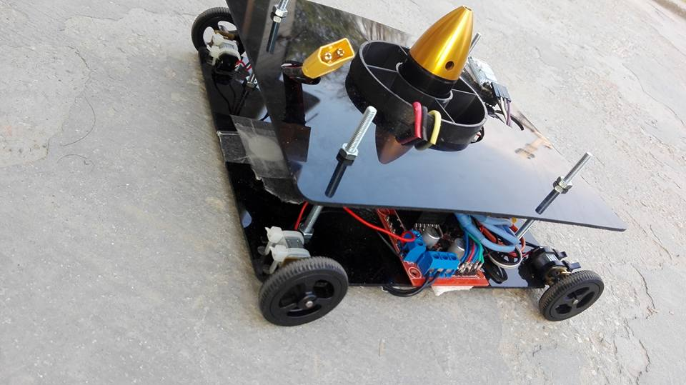
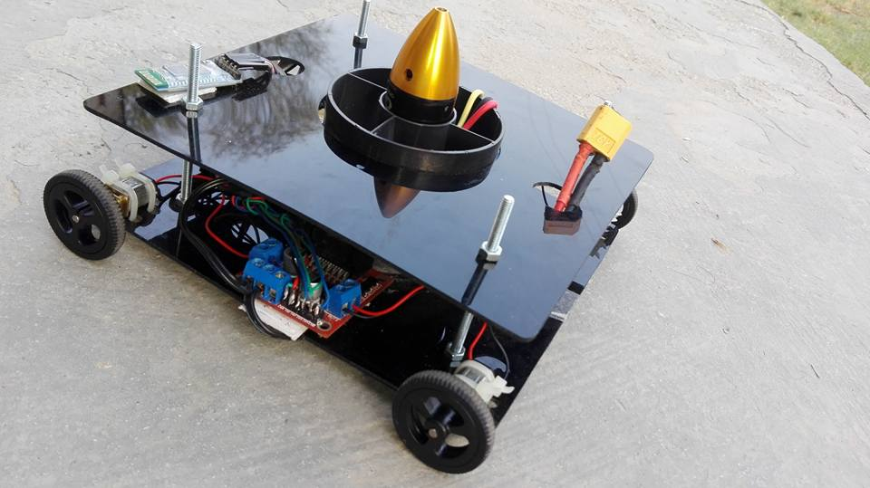

## Android Application

The robot is controlled using the *Arduino Bluetooth RC Car* App on an Android phone. The APK for the app is included in the repository.

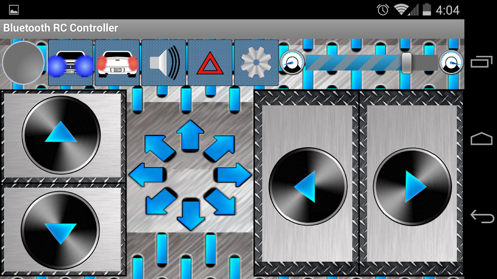

## Code

The main code for controlling the wall climbing robot is provided in the `Wall_Climbing_Robot_V2.ino` file. This code is written for the Arduino platform and utilizes various libraries to control the motors, sensors, and other components.

### Installation and Setup
1. **Clone the Repository**
   ```sh
   git clone https://github.com/yourusername/wall-climbing-robot.git
   cd wall-climbing-robot

2. **Upload the Code to Arduino**
   - Open `Wall_Climbing_Robot_V2.ino` in the Arduino IDE.
   - Connect your Arduino Pro Mini to your computer.
   - Select the appropriate board and port from the Tools menu.
   - Upload the code to the Arduino.

3. **Assemble the Robot**
   - Connect the motors, sensors, and other components as per the circuit diagram provided in the repository.
   - Ensure all connections are secure and correct.

4. **Power Up the Robot**
   - Use the Lipo battery to power up the robot.
   - Ensure the battery is fully charged using the Imax RC B3 pro charger.

5. **Install the Android App**
   - Install the Arduino Bluetooth RC Car App on your Android phone using the APK provided in the repository.
   - Pair your phone with the HC-05 Bluetooth module.

6. **Control the Robot**
   - Use the app to control the speed of the robot and the fan.

### Safety and Maintenance

- Always use the charger under supervision.
- Keep the charger in a dry environment and away from fire.
- Do not pull or replace the power cord abruptly.
- Unplug the charger after use to extend its lifespan.
- Children should use the charger under adult supervision.

## Components Used

### JA12-N20 Model DC 12V 100RPM Torque Gearbox
- **Model**: JA12-N20 Speed Reduction motor
- **Diameter**: 12mm
- **Motor Length**: 26mm
- **Shaft length**: 10mm
- **Voltage range**: DC 1.5-12.0V
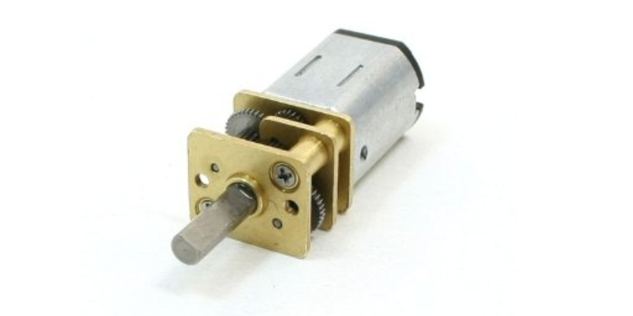

### IMAX RC B3 pro 2-3S Lipo Battery Charger
- **Input voltage**: AC 110V-240V
- **Balance charging current**: 850mA
- **Display**: green and red LED
- **Envelope**: plastic dimension: 90mm * 55mm * 35mm
- **Weight**: 180g
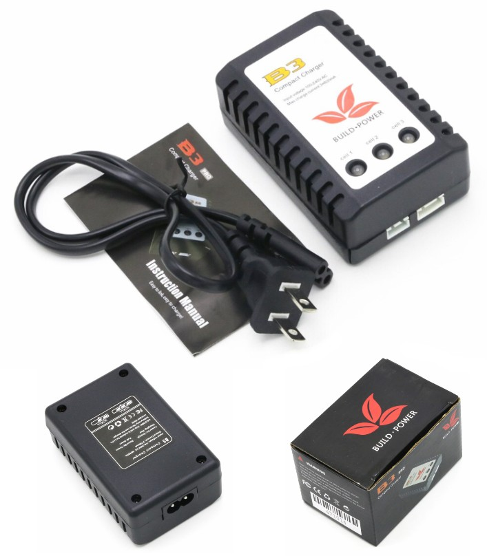

### Lipo battery 5200mAh 11.1V 30C 3S Li-po 3 cell
- **Product type**: lithium polymer rechargeable battery
- **Battery Model**: LION Power 11.1V 5200M 30C
- **Battery capacity**: 5200mAh
- **Continuous discharge rate**: 30C
- **Dimensions**: 42mm x 136mm x 30mm
- **Weight**: 390g
- **Plug Type**: balancing charge plug, plug with JR, FUTABA plug
- **Charging current**: 0.5-3A
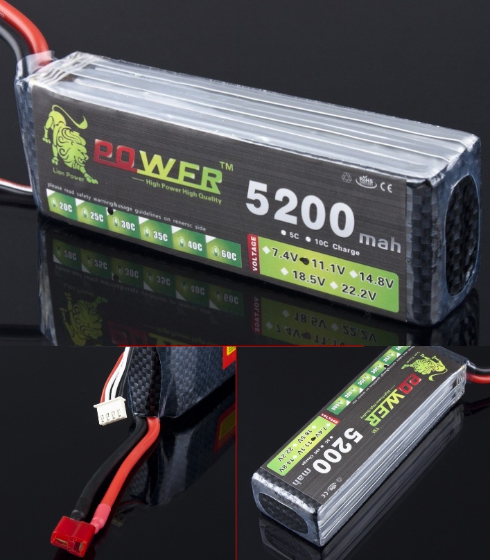

### 70mm 6 blade 3200kv 3s EDF duct fan with motor
- **Rotor Diameter**: 68mm
- **Outer Diameter**: 70mm
- **Weight**: 98g
- **Propeller**: 5 Blade Propeller
- **Working Voltage**: 3s
- **Motor**: Brushless Motor QF2611 4500kv
- **Maximum Current**: 25A
- **Thrust**: 1.2kg
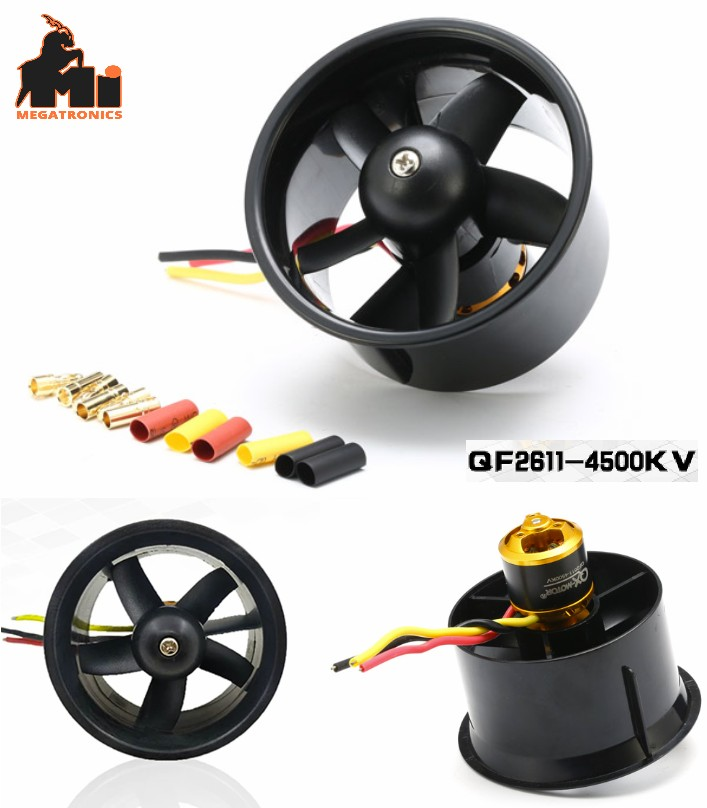

### L293D Motor Driver Control Shield for Arduino
- 2 interface for 5V Servo connected to the high-resolution dedicated timer - no jitter
- Can drive 4 DC motors or 2 stepper motors or 2 Servo
- Up to 4 bi-directional DC motors with individual 8-bit speed selection
- Up to 2 stepper motors (unipolar or bipolar) with single coil, double coil or interleaved stepping
- 4 H-Bridges: per bridge provides 0.6A (1.2A peak current) with thermal protection, can run motors on 4.5V to 36V DC
- Pull down resistors keep motors disabled during power-up
- Reset button
- 2 external terminal power interface, for separate logic/motor supplies
- Tested compatible for Mega, Diecimila & Duemilanove
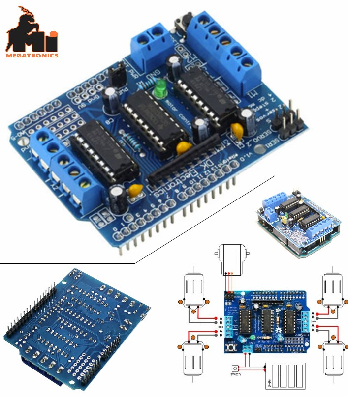

### BHC05-B185: HC-05 Wireless Bluetooth Transceiver Module HC05 Bluetooth receiver Arduino rasp
- **Operating voltage**: 3.3V
- **Working current**: matching for 30mA, matching the communication for 8mA
- **Uses the CSR mainstream bluetooth chip, bluetooth V2.0 protocol standards**
- **Default baud rate**: 9600, the user can set up
- **Compatible with computer and bluetooth, bluetooth adapter, PDA, seamless connection equipment**
- **No dormancy**
- **Input power supply**: 3.3~6V, prohibit more than 7V
- **Commercial Series**: Bluetooth module board Series
- **LED indicator light**: use 150mA and 3.3V regulation chip
- **VCC, GND, TXD, RXD foot for the Bluetooth**
- **"Re-search" button**: (ON/OFF/WAKE foot for it, external MCU out input "High level" can control module to re-search)
- **Compatible with bluetooth master module", slave module" or master-slave (whole) module**
- **Allows your device to both send or receive the TTL data via Bluetooth technology without connecting a serial cable to your computer**
- **No "Automatically prevent power supply reversing function"**, so please correctly connect power supply
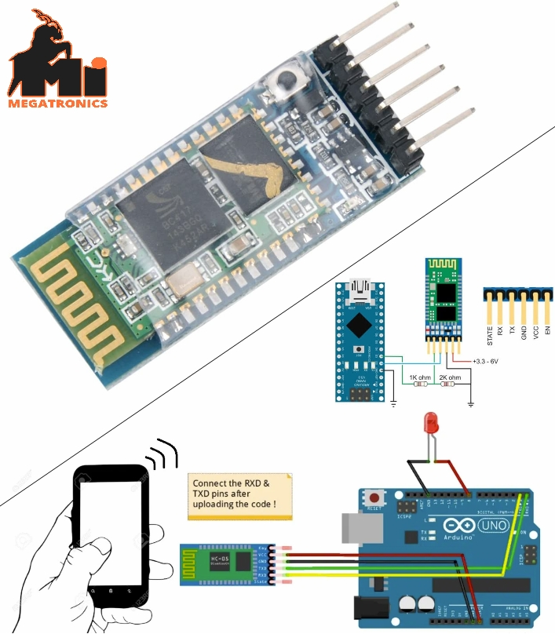

### Arduino Pro Mini ATMEGA328P 5V 16M
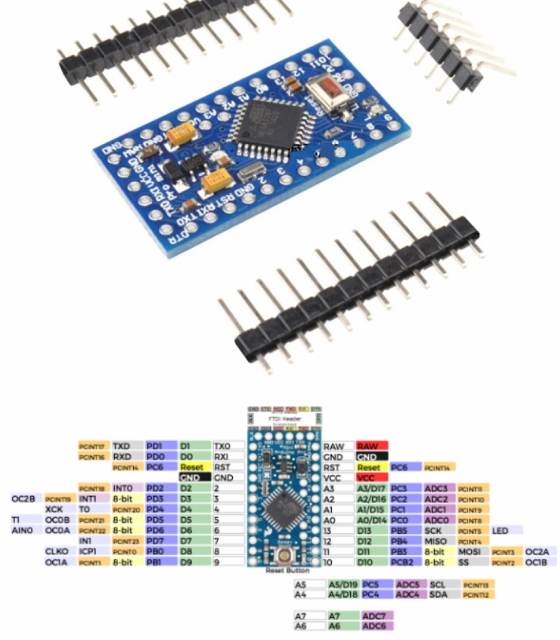

### Electronic Speed Controller
- **Model**: Skywalker-60A-UBEC
- **Continuous Current**: 60A
- **Burst Current (>10s)**: 80A
- **BEC Output**: 5V@5A
- **BEC Mode**: switch mode
- **Refresh rate**: 50Hz-432Hz
- **Battery Cell**: 2-6S (Lipo) / 5-18 cells (NiMH)
- **Net Weight**: 58g
- **Dimension (L x W x H)**: 77 x 35 x 14mm
- **Maximum motor speed Per minute**: 210000 RPM (2 poles), 70000 RPM (6 poles), 35000 RPM (12 poles)
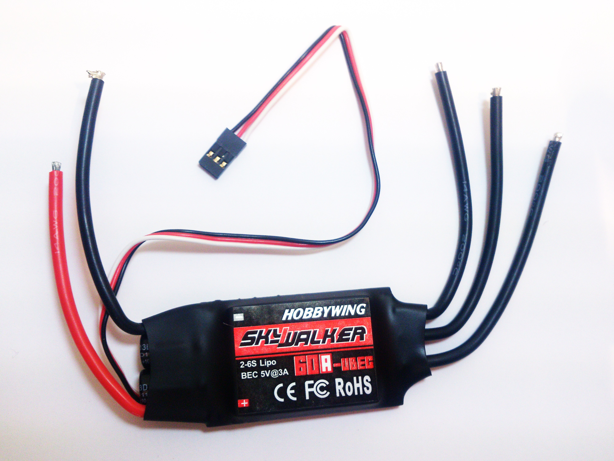

### N20 motor rubber wheel diameter 34mm black
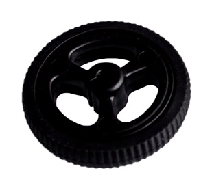

### XT60-B136: XT60 Bullet Connectors plugs Male / Female RC lipo
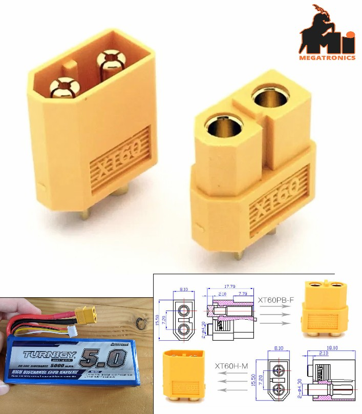

